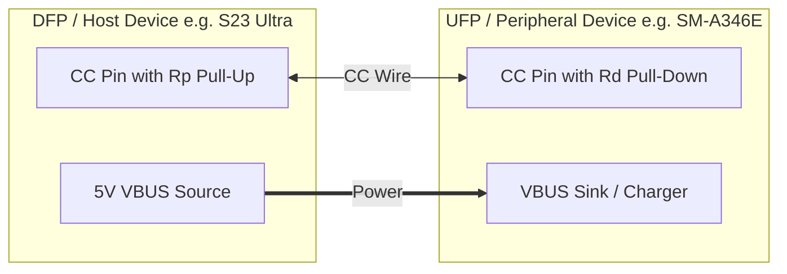
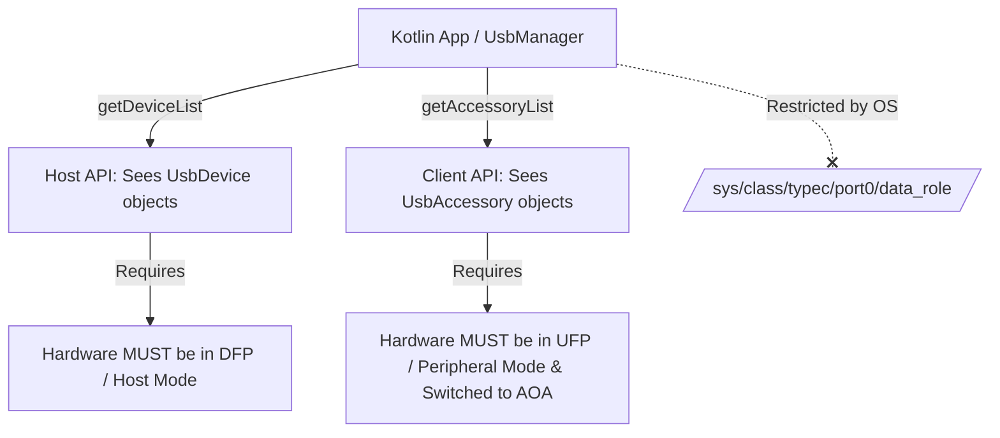

# Android USB-C Host/Client Hardware & OS Specifications

This technical briefing explains the exact hardware mechanisms, OS-level architecture, and protocol rules that govern **USB Host vs. USB Client (Accessory)** roles when connecting two Android devices via USB-C.

---

## 1. USB-C Hardware Role Detection (CC Pins & DRD)

When two Android devices are connected via a standard USB-C to USB-C cable, the roles (**Host/DFP** vs. **Device/UFP**) are negotiated at the physical electrical level **before** the Android OS USB framework even initializes.

### Configuration Channel (CC1 & CC2) Logic
Every USB-C port has two Configuration Channel pins (`CC1` and `CC2`). These pins determine:
1. **Cable attachment & orientation** (normal vs. flipped).
2. **Data Role**: **DFP** (Downstream Facing Port = USB Host) vs. **UFP** (Upstream Facing Port = USB Peripheral).
3. **Power Role**: **Source** (supplying 5V VBUS) vs. **Sink** (consuming VBUS).



- **Rp (Pull-Up Resistor)**: Asserted by the port wanting to act as **DFP (USB Host)**.
- **Rd (Pull-Down Resistor)**: Asserted by the port wanting to act as **UFP (USB Peripheral/Device)**.

### Dual Role Device (DRD / OTG) Negotiation
Modern Android smartphones are **DRD (Dual Role Data)** ports: they can act as either Host or Peripheral. When two DRD smartphones are connected together with a C-to-C cable:
- Both ports start in **DRP (Dual Role Port) Toggle Mode**, rapidly alternating between asserting **Rp** (trying to be Host) and **Rd** (trying to be Device).
- **The first device to catch the other in the opposite state locks the role.**
- In practice, **flagship devices with higher-end USB controllers** (like the Samsung Galaxy S23 Ultra with Snapdragon 8 Gen 2 / USB 3.2 Gen 1) almost always win the **Rp (Host)** assertion when connected to mid-range devices (like the Galaxy A34 SM-A346E with Exynos 1380 / USB 2.0).

> [!IMPORTANT]
> **Hardware Priority Over Software:** Once the Type-C hardware/firmware locks one device as DFP (Host) and the other as UFP (Device), the Linux kernel configures the USB PHY accordingly. **An Android user space application cannot magically override this physical DFP/UFP hardware lock** without specialized system/root capabilities.

---

## 2. Android OS & Linux Kernel USB Architecture

From the bottom of the stack to your Kotlin application, the USB pipeline works as follows:

| Layer | Component | Responsibility |
|---|---|---|
| **Hardware / PHY** | Type-C Controller & USB PHY | Monitors CC pins, negotiates DFP/UFP role, switches USB data lanes. |
| **Linux Kernel** | Type-C Sysfs (`/sys/class/typec/`) | Exposes data roles (`host` vs `device`) and power roles (`source` vs `sink`). |
| **Linux Kernel** | Host Controller (`xhci-hcd`) vs Gadget (`configfs`) | If DFP: loads `xhci` driver to enumerate downstream devices.<br>If UFP: loads `configfs` gadget driver (MTP, PTP, AOA, or Charging). |
| **Android HAL** | `android.hardware.usb` HAL | Monitors kernel uevents (`ACTION_USB_STATE`, `sysfs` changes) and notifies system server. |
| **System Server** | `UsbService` / `UsbDeviceManager` | Manages permissions, sends system broadcasts (`USB_DEVICE_ATTACHED`, etc.). |
| **App Framework** | `android.hardware.usb.UsbManager` | Provides public APIs: `getDeviceList()` (for Host) and `getAccessoryList()` (for Peripheral). |

### What App Developers Can vs. Cannot Do (Permission Model)



- **Without Root (`normal apps`)**: You can only use `UsbManager`. If the hardware locked your port as UFP (Peripheral), `getDeviceList()` will **always return empty**. You cannot force the OS to flip to Host mode via API.
- **With Root / System Privileges**: You can command the Linux Type-C class driver to request a **USB Power Delivery (PD) Data Role Swap (DR_SWAP)**:
  ```bash
  # Check current data role
  cat /sys/class/typec/port0/data_role
  # [host] device   OR   host [device]

  # Force data role swap to host (only works if remote device accepts DR_SWAP)
  echo host > /sys/class/typec/port0/data_role
  ```

---

## 3. Host Mode vs. Client (AOA) Mode API Summary

When building peer-to-peer Android USB transfer apps, each side interacts with a completely different set of OS APIs depending on its hardware role:

### When Android is the USB Host Controller (e.g. S23 Ultra)
1. **Enumeration**: `usbManager.deviceList.values` returns the connected `UsbDevice` (the other phone).
2. **Permission**: `usbManager.requestPermission(device, pendingIntent)` asks user to allow access.
3. **Connection**: `usbManager.openDevice(device)` returns a `UsbDeviceConnection`.
4. **Control Transfers**: Can send raw vendor control requests (`connection.controlTransfer(...)`) on Endpoint 0.

### When Android is the USB Peripheral / Client (e.g. SM-A346E)
1. **Enumeration (Initial)**: `usbManager.deviceList` is **empty**. The device is acting as a standard peripheral (charging/MTP).
2. **AOA Switch (Initiated by Host)**: The Host sends 3 specific vendor control requests (`51 GET_PROTOCOL`, `52 SEND_STRING`, `53 ACCESSORY_START`).
3. **Re-enumeration**: The Linux gadget driver resets the USB port and re-appears with **VID `0x18D1` (Google)** and **PID `0x2D00` or `0x2D01` (AOA Accessory)**.
4. **Enumeration (Accessory)**: The OS fires `ACTION_USB_ACCESSORY_ATTACHED`. Now, `usbManager.accessoryList` returns a `UsbAccessory` matching the strings sent by the Host (`DataTransfer`).
5. **Connection**: `usbManager.openAccessory(accessory)` returns a `ParcelFileDescriptor` for reading and writing raw bulk data.

---

## 4. Why You Can't Freely Make Any Phone "Host" or "Client" with a Standard Cable

As observed in your logs (`SAMSUNG_S23_ULTRA.log` vs `SAMSUNG__SM_A346E.log`):
- When you select **Host on SM-A346E**, `detectDevice()` returns `No USB devices or accessories detected`.
- This happens because **the SM-A346E's hardware port negotiated the UFP (Peripheral) role against the S23 Ultra**. As UFP, `UsbManager.getDeviceList()` sees nothing.

### Hardware Factors Determining Roles:
1. **Chipset DRP Policies**: Snapdragon 8 Gen 2 (S23 Ultra) has USB 3.2 Gen 1 hardware with fast DRP toggle rates and aggressive DFP assertion, easily overpowering Exynos 1380 (SM-A346E) USB 2.0 ports.
2. **Cable Orientation & CC Wiring**: Many USB-C cables have only one CC wire connected (`CC1`), or have E-Marker chips that favor one direction.
3. **Power State & Battery Levels**: USB Type-C power delivery rules sometimes couple data roles with power roles (e.g., the device supplying 5V or charging the other device defaults to Host/DFP).

---

## 5. Practical Guide: How to Control Roles Reliably

To achieve full freedom in choosing which device acts as Host vs. Client, use the following methods:

### Method 1: Use a USB OTG Adapter (100% Hardware Guarantee)
Instead of a direct Type-C to Type-C cable, use:
`[Device A - USB-C OTG Adapter (Female A)]` ↔ `[Standard USB-A to USB-C Cable]` ↔ `[Device B]`

- The **OTG Adapter** internally grounds the CC pin (or legacy ID pin) to force **DFP (Host)** mode on **Device A**.
- **Device B** is forced into **UFP (Peripheral/Client)** mode because it sees a standard downstream A-to-C cable.

### Method 2: Flip or Swap Cable Ends
If using a Type-C to Type-C cable:
- Try unplugging the cable from both ends, flipping one end upside down (`CC1` ↔ `CC2`), or swapping which end goes into which phone first.
- **Plug into the desired Host phone FIRST**, wait 2 seconds for it to assert DFP/Rp, then plug the other end into the Client phone.

### Method 3: Software Auto-Alignment & User Guidance (What Our Code Does)
Since apps cannot override hardware CC pin negotiation:
1. **Always Check Power/Cable Presence**: We use `BatteryManager.BATTERY_PLUGGED_USB` alongside `UsbManager` to know if a physical cable is connected even when `getDeviceList()` is empty.
2. **Graceful UI Feedback**: If a user selects **Host** on a device that hardware locked as **Peripheral**, the app explains that hardware role priority requires flipping the cable or switching to Client mode.
3. **Automatic Role Adaptation**: If a `UsbDevice` appears, our `proceedWithDevice()` automatically aligns the app to **Host** and triggers AOA switching on the remote peripheral. If a `UsbAccessory` appears, our `proceedWithAccessory()` automatically aligns the app to **Client**.
